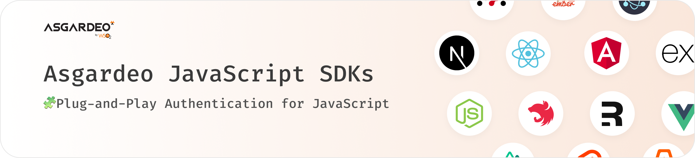

  

  <a href="https://asgardeo.io">Asgardeo</a> . <a href="https://wso2.com/asgardeo/docs/sdks">Documentation</a> . <a href="./CHANGELOG.md">Changelog</a>

  
  
  
  
  

 

  Design secure, secure, and scalable applications with Asgardeo's JavaScript SDKs.

## Packages

| Package | Description |
| --- | --- |
|  | Framework-agnostic JavaScript Core SDK |
|  | Browser-based JavaScript SDK |
|  | Next.js SDK for building applications with Asgardeo |
|  | Node.js SDK for server-side integration |
|  | Express.js SDK for server-side integration |
|  | Nuxt.js SDK for building applications with Asgardeo |
|  | React SDK for building applications with Asgardeo |
|  | Supplementary React Router bindings  |
|  | Vue.js SDK for building applications with Asgardeo |

## Contribute

Please read [Contributing Guide](CONTRIBUTING.md) for details on how to contribute to Asgardeo JavaScript SDKs. Refer to [General Contribution Guidelines](http://wso2.github.io/) for details on our code of conduct, and the process for submitting pull requests to us.

### Reporting issues

We encourage you to report issues, improvements, and feature requests creating [Github Issues](https://github.com/asgardeo/javascript/issues).

**Important**: Please be advised that security issues MUST be reported to <a href="mailto:security@wso2.com">security@wso2.com</a>, not as GitHub issues, in order to reach the proper audience. We strongly advise following the WSO2 Security Vulnerability Reporting Guidelines when reporting the security issues.

## License

This project is licensed under the Apache License 2.0. See the [LICENSE](LICENSE) file for details.
